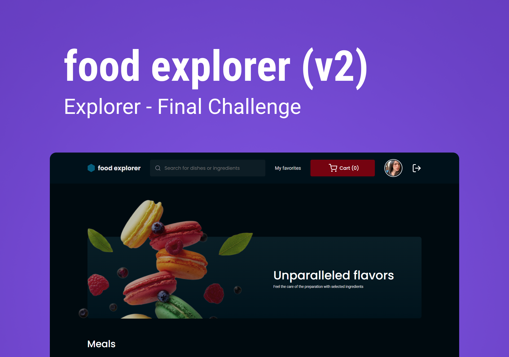

# Food Explorer

Food Explorer is a full-stack application of an interactive menu for a fictional restaurant, developed in the end-of-course challenge of [Rocketseat](https://www.rocketseat.com.br/).



</br>

## 🍝 About

Food Explorer is an end-to-end application developed as part of a challenge, with the aim of creating an interactive menu for a fictional restaurant.</br>
It has two main personas: the administrator, responsible for the restaurant, and the user, who explores and selects the dishes. The administrator can create, view, edit and delete dishes, while the user can view all registered dishes and obtain detailed information by clicking on a specific dish. The project encompasses both the frontend and the backend, based on the layout provided in Figma.

</br>

## 🎨 Layout

You can preview the project layout through [this link](https://www.figma.com/community/file/1196874589259687769). It is necessary to have an account on [Figma](https://figma.com) to access it.

</br>

## 🔨 Features

- [x] Create an account
- [x] Login account
- [x] Edit profile
- [x] Sign out of account
- [x] View all dishes
- [x] List dishes by title and ingredients
- [x] See the details of a specific dish
- [x] Favorite dish
- [x] Remove favorite from dish
- [x] Add items to cart
- [x] Remove items to cart
- [x] Finish order
- [x] Track order status
- [x] Admin: create new dish
- [x] Admin: update dish
- [x] Admin: delete dish
- [x] Admin: manage all orders

</br>

## 🧭 Getting Started

> Before starting, the [backend](https://github.com/palomarodrigs/foodexplorer-backend) must be running before running the frontend.</br>
> After running the backend, you need to have [Node.js](https://nodejs.org/en) installed on your machine and a code editor like [Visual Studio Code](https://code.visualstudio.com/).

</br>

## Running the application:

- in terminal clone this project:

```bash
$ git clone https://github.com/palomarodrigs/foodexplorer-frontend.git
```

- access the project folder:

```bash
$ cd foodexplorer-frontend
```

- install dependencies:

```bash
$ npm install
```

- run server with vitejs:

```bash
$ npm run dev
```

</br>

## 🧪 Tools

- [JavaScript](https://developer.mozilla.org/en-US/docs/Web/JavaScript)
- [React](https://react.dev/)
- [Styled Components](https://styled-components.com/)
- [Vite](https://vitejs.dev/)
- [Swiper](https://swiperjs.com/)
- [Axios](https://axios-http.com/docs/intro)

</br>

## 🚀 Deploy

You can access the project through [this link](https://foodexplorer-palomarodrigues.vercel.app/)

</br>

---

<p align="center">Developed with ❤️ by <a href="https://www.linkedin.com/in/paloma-rodrigues-539000233/" target="_blank">Paloma Rodrigues</a></p>
